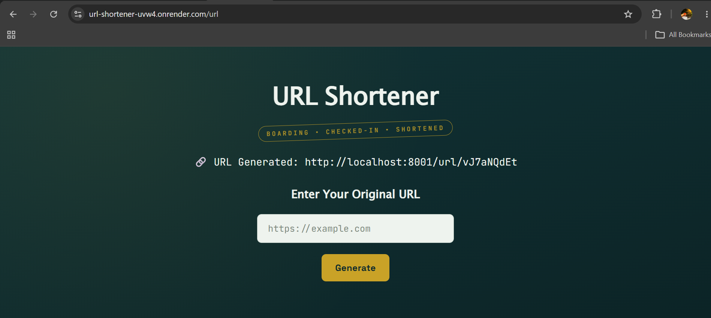
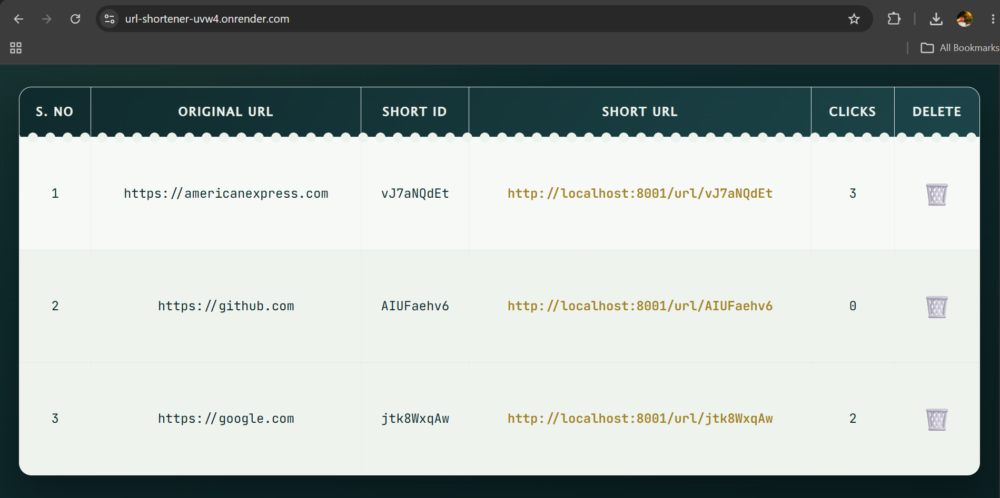
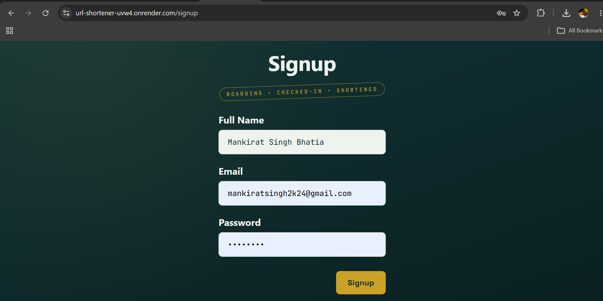
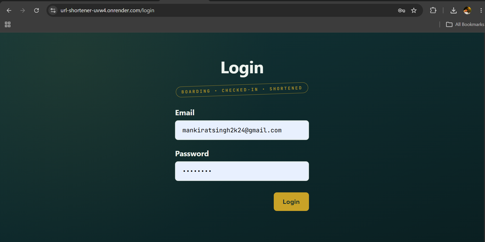
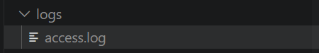
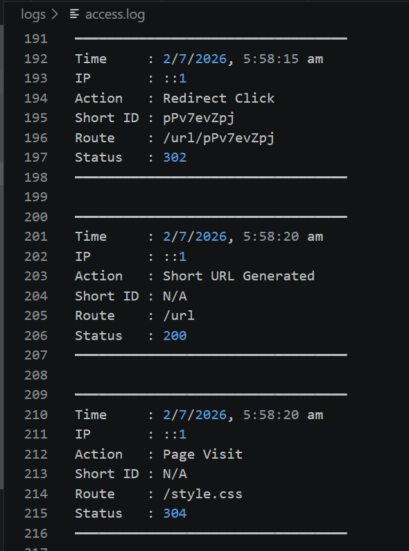

# 🔗 URL Shortener

A full-stack URL Shortener web application built using **Node.js, Express.js, MongoDB Atlas, and EJS** that allows users to create short URLs, manage them, and track redirect analytics.

## 🚀 Live Demo
🌐 https://url-shortener-uvw4.onrender.com

---

## 📌 Features

- 🔐 User Authentication (Signup / Login / Logout)
- ✂️ Generate short URLs from long URLs
- 🔁 Redirect users to original URL using short link
- 📊 Track click count for each shortened URL
- 🗑️ Delete generated URLs
- 📝 Custom access logging using Morgan
- 🍪 Cookie-based session authentication
- ☁️ Cloud database integration using MongoDB Atlas
- 🚀 Deployed on Render

---

## 📸 Project Preview

### Home Page


### URL List / Analytics Dashboard


### Signup Page


### Login Page


### Logs Folder


### Custom Access Logs


---

## 🛠️ Tech Stack

### Frontend
- HTML5
- CSS3
- EJS (Embedded JavaScript Templates)

### Backend
- Node.js
- Express.js

### Database
- MongoDB Atlas
- Mongoose ODM

### Authentication & Middleware
- Cookies
- cookie-parser
- Custom authentication middleware

### Logging / Monitoring
- Morgan
- File System (`fs`) for custom access logs

### Deployment
- Render
- MongoDB Atlas

---

## 📂 Project Structure

```bash
URL-Shortener/
│
├── controllers/
│   ├── url.js
│   └── user.js
│
├── middlewares/
│   └── auth.js
│
├── models/
│   ├── url.js
│   └── user.js
│
├── routes/
│   ├── url.js
│   ├── user.js
│   └── staticRouter.js
│
├── views/
│   ├── home.ejs
│   ├── login.ejs
│   └── signup.ejs
│
├── public/
│   └── style.css
│
├── logs/
│   └── access.log
│
├── connect.js
├── index.js
└── package.json
```

---

## ⚙️ Working Flow

### 1. User Signup / Login
- New users create account using signup page.
- Existing users log in securely.
- Session maintained using cookies.

### 2. URL Generation
- User enters original long URL.
- Application generates unique short ID using shortid.
- Data stored in MongoDB.

Example:

Original URL:
```text
https://americanexpress.com
```

Generated Short URL:
```text
https://url-shortener-uvw4.onrender.com/url/vJ7aNQdEt
```

---

### 3. Redirection
When user visits short URL:

```bash
/url/:shortId
```

Backend:
- Finds matching shortId
- Updates click history
- Redirects to original URL

---

### 4. Analytics Tracking
Each click is stored with timestamp.

Example document:

```json
{
  "shortId": "vJ7aNQdEt",
  "redirectURL": "https://americanexpress.com",
  "visitHistory": [
    {
      "timestamp": "2026-07-02T05:58:15Z"
    }
  ]
}
```

---

## 📈 Logging System

Implemented custom request logging using **Morgan**.

Logs stored in:

```bash
logs/access.log
```

Tracks:
- Time
- IP Address
- Route
- Status Code
- Action Type

Example log:

```text
━━━━━━━━━━━━━━━━━━━━━━━━━━━━━━━━━━
Time     : 2/7/2026, 5:58:15 am
IP       : ::1
Action   : Redirect Click
Short ID : pPv7evZpj
Route    : /url/pPv7evZpj
Status   : 302
━━━━━━━━━━━━━━━━━━━━━━━━━━━━━━━━━━
```

---

## 🧠 Key Concepts Used

- MVC Architecture
- RESTful Routing
- Authentication Middleware
- Route Protection
- Database CRUD Operations
- Redirect Handling
- Server-side Rendering (EJS)

---

## 🖥️ Local Setup

### Clone repository
```bash
git clone https://github.com/Mankirat1010/URL-Shortener.git
cd URL-Shortener
```

### Install dependencies
```bash
npm install
```

### Create `.env`
```env
MONGO_URL=your_mongodb_connection_string
```

### Run project
```bash
node index.js
```

Server runs at:

```bash
http://localhost:8001
```

---

## 🔥 Challenges Faced

- MongoDB Atlas authentication setup
- Cloud deployment on Render
- Fixing route issues for login/signup
- Handling production environment variables
- Managing localhost vs production URL generation

---

## 📚 Learning Outcomes

Through this project, I strengthened my understanding of:

- Backend development using Node.js & Express
- MongoDB integration
- Authentication workflows
- Deployment pipelines
- Production debugging
- Logging & monitoring systems

---

## 👨‍💻 Author

**Mankirat Singh Bhatia**  
B.Tech CSE | UIET Chandigarh  
Interested in **Data Analytics, Backend Development & Full Stack Projects**

GitHub: https://github.com/Mankirat1010
